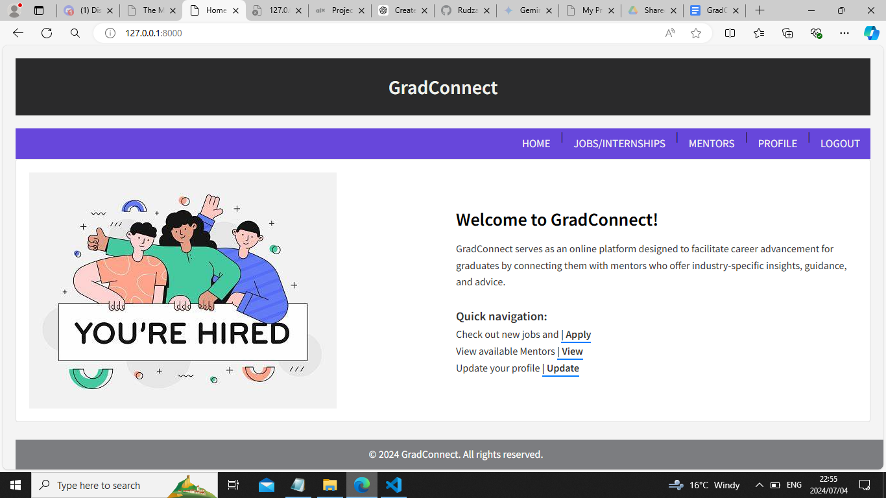

# 🎓Gradconnect


## Introduction
Gradconnect is a Django-based web application designed to connect graduates with mentors, job opportunities, and networking events. This project aims to provide a platform for graduates to build professional relationships and advance their careers.

### Inspiration
The inspiration for this project came from the high unemployment rate among South African graduates, we witnessed the struggle to find relevant employment. Many graduates, lacking guidance on job search strategies and industry knowledge, end up accepting any available position. This lack of experience further hinders their pursuit of their dream careers. Recognizing this frustration, we developed a job search website. This platform connects graduates with experienced mentors who can provide guidance, share industry insights, and ultimately, empower them to land their desired jobs.

### Technical Challenges
Building Gradconnect presented several technical challenges. One of the main challenges was implementing the mentor-mentee matching algorithm. I chose to use a weighted scoring system that considers various factors such as interests, professional background, and location. This required extensive research and testing to ensure accurate and meaningful matches.

### Struggles and Lessons Learned
One of the significant struggles was managing user authentication and profile management. Ensuring secure and efficient handling of user data was paramount. We also faced challenges with the integration of third-party services for job postings and notifications. These experiences taught me the importance of planning, testing, and iterating on features.

### Future Iterations
In the future, we envision adding more advanced features such as real-time chat between mentors and mentees, machine learning algorithms for improved job recommendations, and expanded networking event management. We also plan to enhance the UI/UX based on user feedback to make the platform more intuitive and user-friendly.

## Table of Contents
- [Introduction](#introduction)
- [Deployment](#project-deployment)
- [Colaborators](#Collaborators)
- [Features](#features)
- [Requirements](#requirements)
- [Installation](#installation)
- [Usage](#usage)
- [Related Projects](#related-projects)
- [Project Structure](#project-structure)
- [Contributing](#contributing)
- [License](#license)

## Project Deployment
- Visit [GradConnect](https://rudzee.pythonanywhere.com/accounts/login/)

## Collaborators
- Rudzani Matidze - [Github](https://github.com/RudzaniMatidze) [Blog](https://medium.com/@rdzmatidze/working-on-gradconnect-my-first-portfolio-project-09248b79a37a ) [LinkedIn](https://za.linkedin.com/in/rudzani-matidze-b78431150)
- Thomas Manhica - [Github](https://github.com/ManhicaThomas) [Blog]() [LinkedIn](https://www.linkedin.com/in/thomas-manhica-772679244)

## Features
- User authentication and profile management
- Mentor-mentee matching system
- Job postings and application tracking
- User-friendly dashboard and profile editing

## Requirements
- Python 3.x
- Django 3.x or later
- SQLite (default) or other preferred database
- Virtualenv (recommended)

## Installation
1. Clone the repository:
    ```sh
    git clone https://github.com/RudzaniMatidze/GradConnect.git
    cd gradconnect
    ```
2. Create and activate a virtual environment:
    ```sh
    python3 -m venv env
    source env/bin/activate  # On Windows use `env\Scripts\activate`
    ```
3. Install the required packages:
    ```sh
    pip install -r requirements.txt
    ```
4. Apply migrations:
    ```sh
    python manage.py migrate
    ```
5. Create a superuser:
    ```sh
    python manage.py createsuperuser
    ```
6. Run the development server:
    ```sh
    python manage.py runserver
    ```

## Project Structure
<ul>
<li>gradconnect/</li>
<li> -- gradconnect/ # Project configuration files</li>
<li> ------ init.py</li>
<li> ------ settings.py # Settings for the project</li>
<li> ------ urls.py # URL routing</li>
<li> ------ wsgi.py # WSGI entry point for deployment</li>
<li> -- app/ # Main application code</li>
<li> ------ migrations/ # Database migrations</li>
<li> ------ static/ # Static files (CSS, JavaScript, Images)</li>
<li> ------ templates/ # HTML templates</li>
<li> ------ init.py</li>
<li> ------ admin.py # Admin configuration</li>
<li> ------ apps.py # Application configuration</li>
<li> ------ models.py # Data models</li>
<li> ------ tests.py # Unit tests</li>
<li> ------ views.py # View functions</li>
<li> -- manage.py # Command-line utility for running and managing the project</li>
<li> -- requirements.txt # Python package dependencies</li>
</ul>

## Usage
- User Registration
Users can sign up by clicking the "Register" link on the homepage. After registration, they can log in to access their dashboard.

- Profile Management
Users can edit their profiles by navigating to the "Edit Profile" section. Here, they can update their personal information, and manage their visibility settings.

- Mentor-Mentee Matching
Graduates can search for mentors based on their interests and professional background. Mentors can approve or decline connection requests from graduates.

- Job Postings
Users can browse and apply for job postings. Users can track the job application status.

## Related Projects
django-crispy-forms: Third-party Django application for easier form styling.
Bootstrap: Front-end framework used for responsive design.

## Licence
This project is licensed under the MIT License. See the [LICENSE](LICENSE) file for details.